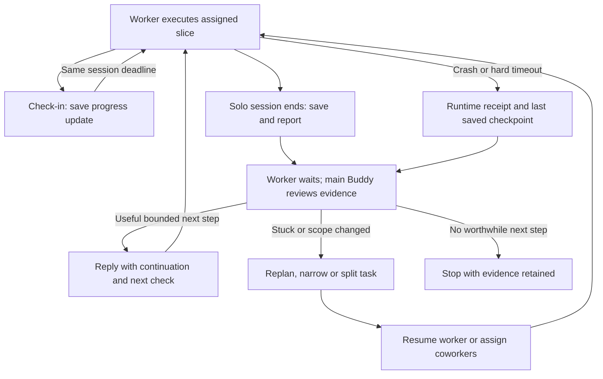

# Worker check-ins, solo sessions and limits

September 13, 2026 · Single reference for execution limits in the current design.

The [owner follow-up](final-designs-2026-09-13/06-handoff-and-limits-successor.md)
selects the product flow below. Detailed accounting and runtime mechanics remain
proposals. The [implemented behavior](#implemented-behavior) section describes
today's contract separately; this document does not change running work.

## Owner direction

Give a Worker a maximum solo work session before required review, with more
frequent progress check-ins during that session. At the required review
boundary, it reports and waits while the main Buddy examines its actual work.
The main Buddy judges whether it is making useful progress, spinning, blocked,
wasting effort, or discovering a larger task than expected.

If a little more effort would help, the main Buddy replies with a bounded
continuation and the **same sub-buddy resumes**. Otherwise it stops the current
approach, replans, narrows or splits the task, then resumes the existing worker
or assigns suitable coworkers. Reaching the boundary should lead to a useful
management decision, without routinely asking the human to drive the loop.

Numeric defaults, metering units and a particular database/API shape were not
selected by this owner instruction.

The owner's [latest clarification](final-designs-2026-09-13/08-check-ins-and-solo-sessions-successor.md)
reframes this control as time until required report-back, with frequent check-ins
as well. **Check-in interval** and **Maximum solo work session** are the proposed
control labels. A spending budget can remain a separate resource constraint;
it does not explain when a Worker owes its lead an update or a review.

The later [Worker clarification](final-designs-2026-09-13/07-workers-mail-and-prompt-successor.md)
names the sub-buddy **Worker** and permits one parent-owned Worker to handle
multiple related tasks. Worker identity is not the accounting root: a coherent
batch may contain related tasks within one authorization, while distinct
authorizations retain separate accounting and review decisions even when the
same Worker handles them. Switching tasks or sending a Prompt cannot reset an
allowance. This refines the proposed accounting below, not today's native schema.

## One policy, one place to inspect it

Proposed implementation: one versioned execution-policy definition and resolver
at the canonical package admission/accounting boundary. Preview, dispatch,
scheduling, claims, runtime deadlines and UI consume its resolved result.
Remove repeated default literals and budget calculations from those consumers;
they should enforce the resolved decision and record what actually applied.
The host supplies foreground and watchdog settings explicitly to the resolver.

One **Limits** view shows the last check-in, next check-in due, required review
time, remaining authorization, usage, any calendar deadline, the lead responsible
for review, and the reason
work is waiting. Advanced details show the unit, policy version, source of each
effective constraint and the limiting cause. Multiple views may display the
same projection; they must not own independently editable balances.

The policy is a supporting value/accounting record, not another user-facing
Task, Report, Desk or Budget workflow object. Its controls answer different
questions even though their definition and explanation live together:

| Control | Meaning | Boundary behavior |
|---|---|---|
| Check-in interval | Maximum time between useful progress updates while working | Save a brief update and continue within the current session |
| Maximum solo work session | Maximum time working without a required lead review | Save, report, release execution and wait for the lead |
| Total authorized effort | Cumulative ceiling for the original assignment and its descendants | Prevent further work allocation when no spendable effort remains |
| Calendar deadline, if set | When the assignment expires even while waiting | Retain work/evidence and report expiration |
| Attempt and liveness safeguards | Bound one executor and detect an unresponsive provider/bridge | End that attempt truthfully, drain it and notify the lead |
| Admission limits | Concurrent occupancy, eligible rate and queue capacity | Keep one reasoned pending item and wake when eligible under policy |
| Action permissions | Which operations and external effects are authorized | More effort does not expand permission |

A routine capacity wait is not a request for more task effort. An explicit owner
pause or stop is not a rate window that automatically clears. Human Conversation
admission follows the owner-access requirement in
[LATEST_HUMAN_DESIGN](LATEST_HUMAN_DESIGN.md#conversations), independently of
background allowances; automatic descendants remain background work.

## Frequent check-ins within a solo session

Proposed behavior: check-ins say what changed or was learned, link available
evidence, identify blockers and state the next step. Send one sooner when blocked,
repeating an unsuccessful approach, discovering material scope growth, needing a
decision, or finishing the work. A routine update lets the Worker continue; a
decision needed to proceed puts the affected work into a visible wait.

The check-in interval is shorter than the maximum solo session. For illustration
only: check in every 5 minutes; pause for required review after 30 minutes.
An update at minute 25 does **not** move that review to minute 55. A delivered
message or acknowledgment is not an extension. Only an explicit lead decision
sets a new bounded session for the same Worker, within its existing authority.

The host records these as separate obligations. A retry, process restart, task
switch or incoming Prompt does not silently restart either clock. Proposed
timing uses elapsed time within an admitted solo session, including running tools;
queued time and an explicit drained wait do not consume that session. Preserve
the elapsed session time through those waits and show why it is waiting. This
per-Worker supervision clock is separate from aggregate resource accounting
across Workers. Exact timing and default values remain implementation proposals.

A missed check-in becomes visibly overdue and produces one retained notification
to the lead; it is not evidence that the Worker is necessarily wasting time.
For a long tool call, show the observed operation and last real checkpoint instead
of fabricating a progress report. Coalesce routine notices while preserving the
latest evidence and all unresolved decision requests; they need not each start a
lead model turn. Blockers and required reviews need the explicit background wake
route below. The session boundary still pauses work if nobody intervenes earlier.

## Worker report and main Buddy review

The report is the existing proposed composition over task evidence, checkpoint
and message, described in the [candidate design](final-designs-2026-09-13/02-three-final-designs.md#report-is-the-key-composition).
It does not introduce another report store. A required-review cause requests a
decision and holds worker execution; an ordinary informational progress report
can leave the current slice running. Both use one worker lane.

The worker saves artifacts first. The decision packet links the task/criteria
revision and contains:

- Work and information gained since the prior report, including useful failures.
- Exact saved artifacts, checks and effects already performed or still uncertain.
- The blocker, repeated approach, or newly discovered scope, if any.
- A concrete next experiment/deliverable, requested effort and why it would help.
- Host-recorded consumption and the boundary reached, with unknown usage explicit.

The lead inspects that evidence. Tool activity, changed-line count and reassuring
summaries alone do not establish progress. Research that rules out a plausible
cause can be useful even without a patch; a long valid build can justify more
time even with sparse output. Sparse or missing evidence calls for a bounded
inspection before deciding, not an invented judgment about the worker's effort.

| Lead finding | Decision |
|---|---|
| Credible progress; next check is small and useful | Continue the same worker with a bounded slice and explicit next check |
| Same attempt repeated without new evidence | Change the approach before resuming |
| Environment or dependency is blocking progress | Record the blocker; arrange repair or wait for that dependency |
| Task is larger or less clear than expected | Revise the plan; split into concrete deliverables and reassign deliberately |
| Candidate satisfies the criteria | Inspect/accept the exact version under the task's review rules |
| Further effort is not worthwhile | Stop the task or cancel the abandoned portion with rationale |
| Required scope exceeds the outer authorization | Keep it held; obtain the required new authority rather than resetting limits |

The reply expresses a decision with its evidence, next step and granted effort.
The host commits the authorized decision and allocation together, then makes
one continuation eligible. Free-text reassurance alone cannot change execution
authority. A stale task revision, duplicate reply or replay must not create a
second allocation or worker attempt. Exact native command fields are unselected.

## Same worker across the pause

Continuation preserves the Buddy ID, task ownership, permitted memory, inbox,
saved artifacts and execution history. Reuse the compatible worker transcript
and provider session when valid; a provider process need not stay alive while
the lead reviews. A new bounded attempt may be necessary. It does not turn the
old terminal attempt back into a running one.

If the provider or audience changes, start a compatible session from authorized
saved context and retain visible history. Do not create a replacement Buddy
merely because a timer elapsed. If replanning creates independent deliverables,
reuse existing staff or create coworkers within current staffing authority.
All descendants retain the original resource lineage. Drain the old executor
before transfer or replacement so two workers do not repeat the same effects.

Waiting for review releases process occupancy and, under the proposed effort
meter below, consumes no active effort. It preserves the unfinished obligation.
Stopping an approach to replan is a pause/revision; cancelling work is an explicit
terminal disposition. Cancellation and revocation win over queued replies,
renewals and late events. Work is never marked done merely because effort ended.

## Review must remain possible when worker effort ends

At assignment, record a valid background route to the main Buddy and reserve
coordination effort within the same total authorization. A human Conversation
is not that route. A report should wake the main Buddy's message-response
execution (proposed name: Desk turn), not inject an automated owner-chat turn.
Nested worker-leads handle review in their existing task lane.

Begin checkpointing and reporting before the solo session boundary, within the
worker's allocation. Do not depend on the worker sending a message after its hard deadline
has revoked its tools. If it crashes, hangs or is killed first, the runtime
durably records the termination cause and queues one notification using the last
checkpoint and observed effects. It must not fabricate a final report.

Persist notification intent with the boundary transition. Reconcile it after
restart; deduplicate by the cause and recipient. Coalesce only messages with
the same permitted audience and root account. Retain unhandled causes that
arrive while a lead is running or draining.
Waiting for the lead must not hold the worker slot needed to admit that review.
Review effort and admission need an explicit route even when worker capacity is
full; reserving time alone does not reserve a slot.

No response means the worker remains visibly waiting. Missing review authority,
exhausted coordination effort or unavailable admission has a specific reason
and responsible controller. A notification is retained even if no model can
currently review it. The worker does not repeatedly wake itself or spawn a
replacement to escape that state.

## Accounting proposal and unresolved values

Start with one host-bound account for an owner-authorized root assignment,
covering its descendants. The lead may allocate and renew slices only within
the remaining authority delegated to it. A reporting line alone does not mint
resource authority. Task splits, retries, new Buddies, model changes and new
message keys preserve cumulative consumption.

Proposed initial unit: active provider wall seconds summed across concurrently
running attempts. This counts occupied execution, including a running tool or
provider stall; it does not claim to measure productive thinking or dollars.
Queued/drained waiting consumes no active seconds. Failed and cancelled attempts
retain their measured consumption. A separate optional calendar deadline keeps
its stated meaning.

Reserve and settle at the authoritative transaction boundary:

`consumed + outstanding reservations <= authorized total`

Duplicate commands charge once. Uncertain process drain or usage leaves an
explicit unsettled reservation; release only demonstrably unused capacity.
Worker effort and lead review are charged to the same root. Restricted memory
maintenance needs an explicit charge or a separately visible host-maintenance
account; it cannot disappear from a claimed all-system total. Harness helpers
need observable usage or a defensible enforced reservation. Until then, disable
unbounded helper paths for work claiming a hard aggregate limit.

The worker's review point is renewable; the outer ceiling cannot be expanded
by its own descendants. A genuinely new owner-authorized assignment can receive
new resources through an explicit authorization record. Existing elapsed-time
requests retain their old semantics and consumption. Do not silently migrate
them into active-time allocations or revive exhausted receipts.

These units, account scope, report/review reserve sizing, numeric defaults and
exact command/schema choices are assistant proposals pending implementation
selection and verification. This document centralizes them without pretending
the current stored token/cost fields enforce an aggregate spending budget.

## Implemented behavior

Current source observation, September 13, 2026. Full inspected source and the
pending handoff are pinned in the [pre-consolidation snapshot](final-designs-2026-09-13/limits-consolidation-before.json).
The values below are existing behavior, not new recommended settings. Receipts
and execution snapshots determine what an individual historical run received.

| Current path | Existing limit/meaning |
|---|---|
| Foreground owner turn | `TURN_MAX_RUNTIME_MS`, default 24 hours; host passes it explicitly to the Buddy claim |
| Generic background claim / executor fallback | 600 seconds when no explicit attempt cap is supplied |
| Fresh managed-work attempt | Seeded from explicit/inherited policy cap or work duration, capped at 3,600 seconds; smaller valid caps win |
| Managed-work assignment | Defaults: 20 admitted attempts and 3,600 elapsed seconds; schema maxima: 100 and 86,400 |
| Assignment clock | Starts at first admission; child waiting and failed intervals consume elapsed time; attempt deadline is clamped to the original assignment deadline |
| Scheduled automation | Default runtime 600 seconds; separate stored policy and iteration bound; managed-work defaults do not change it |
| Liveness safeguards | Default provider inactivity: one hour; bridge liveness: two minutes; these do not extend an absolute runtime deadline |
| Token/cost fields | Compatibility data; not a verified measured-spending or aggregate-renewal control |

Sources: installed `coordination.js` and `background-work.js`;
[executor](../../server/src/buddies/run-executor.ts),
[scheduler](../../server/src/buddies/scheduler.ts),
[timeouts](../../server/src/constants/timeouts.ts), and the
[ownership contract](AUTOMATION_OWNERSHIP.md). The snapshot preserves their exact
versions. Source checks do not certify loaded-process adoption.

Today, successful unfinished managed attempts continue within their existing
bounds. Supported timeout recovery preserves failed receipts and can create a
linked successor only within remaining original limits. An exhausted assignment
cannot be renewed by `retry_run`; further authorized work needs explicit fresh
bounds after effects inspection. The proposed review/allocation transaction and
aggregate account above are not available native operations today.

## Acceptance for implementation

Use real store/runtime boundaries and one bounded provider journey to verify:

- Routine check-ins keep the Worker running without resetting its required review;
  missing updates show overdue status, and a long tool call is described honestly.
- Retry, restart, task switches and incoming Prompts preserve both supervision
  obligations; an explicit lead continuation creates one new bounded session.
- Blockers and scope changes report early; routine notices coalesce without
  losing required reviews or creating a separate Worker execution lane.
- Useful work reaches a review point, wakes the lead and resumes the same Buddy
  and task with saved context after one approved extension.
- Repeated failure produces changed instructions; scope growth produces bounded
  subtasks; abandoned work stops without losing artifacts or history.
- Timeout before reporting still delivers the true cause and last checkpoint.
- Saturated workers, a sleeping lead and an expired old parent attempt cannot
  silently strand a report or turn a human chat into an automatic consumer.
- Duplicate/stale decisions, concurrent allocations, restart and task splits
  preserve accounting and create at most one eligible continuation.
- Cancellation racing review wins; uncertain effects are inspected before reuse;
  hard-ceiling exhaustion refuses new work while preserving the final notice.
- Preview, effective claim, execution receipt and both shells agree on policy
  version, units, remaining allowance and the cause of a stop or wait.

The [handoff incorporation](final-designs-2026-09-13/06-handoff-and-limits-successor.md)
identifies the existing UI, release, history and diagnostics acceptance that this
new design must preserve. Those remain tracked in native projects.
