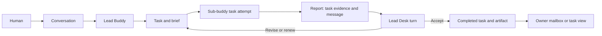

# Three final design candidates

**Historical comparison, before the later owner clarification.** The owner has
since rejected Design 2's task-to-worker lifetime binding, selected **Workers**
as parent-owned temporary Buddies that can handle multiple related tasks using
ordinary Buddy infrastructure, and proposed separating Mail from execution Prompts.
Read the [current successor](07-workers-mail-and-prompt-successor.md) with
[LATEST_HUMAN_DESIGN](../LATEST_HUMAN_DESIGN.md). It refines Design 1; the original
comparison and recommendations below are retained as dated reasoning, not three
currently undecided alternatives. Design 3 remains an unselected alternative.

September 13, 2026 · Complete alternatives for selection, not three implementations
to combine. The [owner direction](../LATEST_HUMAN_DESIGN.md) is preserved separately.
All implementation rules added here are assistant proposals. The later
[owner follow-up](06-handoff-and-limits-successor.md) selects the limit-review
flow; the [single limits specification](../BUDGETS_AND_LIMITS.md) supplies that
policy to all three candidates.

**Recommendation: Design 1, Buddies, Tasks and Desk turns.** It formalizes the
owner's intended workflow with ordinary Buddy identities. The main additions are
reliable reporting, finite coordination, persistent waiting and honest accounting.
The previous [system synthesis](../system-design-review-2026-09-13/06-meta-synthesis.md)
already supports most of these foundations; pinned excerpts are in
[source evidence](05-source-evidence.md).

## Common foundation

All three use Buddy, Task, Message, Document and human Conversation, with the
existing Workspace boundary. Team is a view of relationships and permitted work;
Mailbox is a view of messages. Task owns criteria and completion. Document owns
versioned knowledge. Attempts are internal durable execution records.

They all preserve one current execution owner, source-bound authority, scoped
memory, immutable terminal receipts, cancellation before provider drain, and
effect inspection before uncertain retries. They all keep autonomous execution
out of human conversations. None introduces a general workflow engine, generic
event store or second employee identity system.

| Decision | 1. Buddies, Tasks and Desk turns | 2. Task-owned workers | 3. Uniform Buddy inbox |
|---|---|---|---|
| Center of ownership | Reusable teammate | Task and its attached worker | Buddy's pending work and messages |
| Sub-buddy lifetime | Survives tasks; retire deliberately | Bound to one task, retained for follow-up | Ordinary Buddy; lifetime chosen independently |
| Main Buddy autonomous work | Short Desk coordination only | Short Desk coordination only | Same queue can execute tasks or messages |
| Worker concurrency | One active autonomous task lane | One lane per task worker | One autonomous lane per Buddy |
| Main policy cost | Enforcing task-versus-Desk boundary | Task/worker coupling and promotion | Lead focus relies more on discipline |
| Identity count | Reuse minimizes accumulation | More identities, often one per task | Minimal identities, risk of overloading each |
| Fidelity to owner notes | Highest | High, favors ephemeral assignment identity | Intentional relaxation of main-Buddy restriction |
| Recommendation | Choose | Choose for disposable independent jobs | Choose if role restrictions prove unnecessary |

All have the same five core domain types. Designs 2 and 3 do not claim fewer
objects by hiding worker identity or commitments in metadata. Their differences
are object instances, lifetime coupling and policy complexity.

## Design 1 — Buddies, Tasks and Desk turns

### Product contract

A main Buddy is the owner's conversational partner and team lead. Its autonomous
activity consists of **Desk turns**: bounded message handling, review, decisions,
task organization and delegation. It does not perform sustained background
implementation under a generic self-work loop.

A sub-buddy is an ordinary Buddy assigned to persistent task work. Reuse a
suitable teammate first; create another when an independent concurrent stream,
specialty or context boundary warrants it. One identity has one manager; a
manager may itself report to another manager. Manager is a relationship, not a
separate class. A sub-buddy leading a nested assignment handles coordination in
its existing task lane, with no second autonomous Desk lane.

The sub-buddy is the **persistent handle for background work**. It is not the OS
process itself. Its identity, scoped memory, inbox and task responsibility survive
exits, waiting, retries and tomorrow's feedback. An attempt exists only while it
is doing work. This is the small clarification needed to make “sub-buddies are
background processes” compose with persistence.

Human-created Conversations can address any permitted Buddy, including a worker.
They are separately admitted, never auto-created or auto-advanced by reports.
One conversation still serializes its own turns. Background caps never reject an
eligible human turn; foreground has reserved host headroom and a distinct actual
host/provider-failure explanation. A finite machine cannot promise unlimited
simultaneous processes. Accepted input remains visible in all cases.

### One work lifecycle

Target Task states are `ready → in_progress → review → done`, with `blocked` and
`cancelled` exits. Grouping/backlog views need no second execution state machine.
Pause, capacity wait, child wait and exhausted allowance are execution conditions
on the task, not evidence that the intended outcome was achieved.

Worker closure has precise meaning: it finishes the assigned execution slice and
reports a candidate. For tasks requiring review, the Task is `review` until the
lead inspects the pinned artifact and criteria revision. Acceptance closes it;
revision feedback returns it to the same worker. A routine task may omit separate
review when its original criteria explicitly allow that. A worker does not add
or remove a review requirement to get its own task closed.

An accepted task can later receive a question without reopening it. A requested
change to its deliverable creates an explicit revision/reopen or follow-up Task,
so previously accepted evidence remains historically true. Reassignment drains
the old executor and publishes the needed handoff; it never transfers private
memory merely because the Task owner changed.

Required child work and explicit blocking dependencies refer to Tasks. Reject
dependency cycles at the write boundary. A waiting worker releases its claim
after drain and resumes from a durable message/dependency change, rather than
polling with model turns. Optional related work does not prevent parent closure.

### `report` is the key composition

Proposed semantic call, **not today's native schema**:

```text
report(task, expectedRevision, key,
       progress | effort_review | blocked | ready_for_review | completed,
       summary, savedEvidence, nextStep, requestedEffort?)
```

It has four effects through existing authorities:

1. Revision-check the task and record the worker's actual progress/evidence.
2. Save an attempt checkpoint with saved artifact versions, known effects and
   resume instructions when the report changes the recovery position.
3. Persist one Message to the task's supervising lead, linked to that task
   revision and attempt. No independent Report completion status exists.
4. Make one durable Desk input eligible, or append it to the lead's already
   pending batch. A task change and its notification intent commit together;
   delivery retry never repeats the worker's completed effects.

Only the semantic `report` operation orchestrates this combination. Low-level
task changes use the same notification reconciliation, so bypassing a convenience
tool does not silently lose the lead wake. Deduplication uses stable cause IDs,
task revision and recipient. UI refetches, read markers, duplicate deliveries
and audit writes are not new causes.

Every committed progress report and relevant task transition becomes pending
lead attention, as requested by the owner. Several updates may be handled in
one Desk turn. Blocking, review-ready, completion and effort-boundary reports
make that pending turn immediately eligible; progress updates can coalesce up
to a bounded dispatch delay. A busy lead consumes them at its next safe boundary.
Coalescing must retain all causes and never leave the final progress update
waiting forever. A Desk response does not automatically demand another response;
informational acknowledgments end the exchange.

### Reliable wake and finite coordination

A lead needs incoming-work authority, a valid background scope and the review
provisioning defined in [limits](../BUDGETS_AND_LIMITS.md#review-must-remain-possible-when-worker-effort-ends).
The product records that return route during
assignment, even if assignment starts from a human chat. This is the missing
composition in today's `mailbox_only` path: creating a human-originated task
must not accidentally choose the human transcript as the autonomous consumer.

The Desk is an existing pending-input queue plus scoped execution session and
processed-message cursor. It is not a new employee or permanent process. At most
one autonomous Desk/task attempt runs for that Buddy at once; a human Conversation
uses its independent foreground class. Desk contexts are keyed by permitted
workspace/audience, never one global private memory transcript for all teams.

Batch only causes with the same permitted audience and the accounting scope
defined in [limits](../BUDGETS_AND_LIMITS.md#accounting-proposal-and-unresolved-values).
Other causes remain separate pending batches, serialized through the same lane.

A Desk turn reads changes, makes a bounded decision, records review or sends
work, and ends. If it discovers substantial implementation, it creates/assigns
a Task. The shared [limits policy](../BUDGETS_AND_LIMITS.md) also governs Desk
execution. Small reviews can read code and run a bounded check. Large reviews
become explicit Tasks too.

<a id="effort-and-budget"></a>

### Budgets and limits

All three candidates use [Buddy budgets and limits](../BUDGETS_AND_LIMITS.md).
It is the only current specification of review points, lead decisions,
same-worker continuation, total authorization, accounting, report delivery at
expiry and implementation acceptance.

### Models, memory and parallel work

The owner preference remains Astra for planning/review, Sol medium for planned
implementation, Luna low/high for suitable smaller slices. A task pins its
requested provider/model/effort at acceptance through canonical selection intent.
Each attempt records its resolved configuration. Overrides never edit Buddy
defaults. Explicit model revisions take effect at a drained attempt boundary;
provider/audience incompatibility starts a fresh session with a scoped handoff.
Missing model availability produces a visible error, not silent substitution.

Give the worker current criteria, the smallest sufficient brief, constraints,
exact output location, relevant versioned decisions, verification commands and
reporting scope. Detailed documentation stays available by authorized retrieval.
Do not copy the lead's whole conversation into every worker. Do not require a
large planning document for a trivial change.

Harness sub-agents are temporary helpers with no separate Buddy inbox or memory.
They finish or are cancelled within the parent attempt and share its permitted
scope; resource treatment follows [limits](../BUDGETS_AND_LIMITS.md#accounting-proposal-and-unresolved-values).
Use a permitted cheaper model for a clean independent slice where the harness
supports it. Otherwise the worker asks the lead for a
coworker. A model can be changed without hiring another identity merely to hold
that setting. All persistent parallel responsibilities belong to teammates.

### The journey



There is no automatic arrow from a report back into the human Conversation.

### Other system cases

Schedules emit a Task assignment or a short Desk message under the existing
schedule authority. They do not own a separate autonomous loop. A maintenance
reviewer remains a restricted internal process with no employee identity: it
cannot send, delegate or pursue goals. This is a proposed explicit exception to
the literal “every background process” wording, preserving the earlier accepted
independent reviewer design. The user-facing rule covers background employee work.

External email, publishing, training and resource acquisition still go through
their authorized adapters and effect receipts. A progress report cannot authorize
an email or certify a scientific breakthrough. GPU reservation metadata does not
become a host lease. Peer team views show permitted task state and published
reports, without private chat bodies or scoped memory.

Idle workers remain addressable. Retire only when no open responsibility or
expected review remains, and preserve task/artifact discovery after retirement.
No automatic archive policy is needed for the first release.

### Migration and decisive acceptance

Expose Task as a consistent projection over projects/todos first; preserve IDs
and one writer. Introduce report as a transaction over existing work/checkpoint/
message services. Add the Desk route to task delegation, preserving historical
mailbox-only receipts. Migrate legacy self-background implementation by explicit
task assignment with a drained ownership transfer. Existing schedules acquire
one new producer route only after the old executor is disabled for that occurrence.

Verify: human chat during full background capacity; one lead wake for duplicate
reports; progress arriving during/after Desk drain; lead review after worker
exhaustion; worker crash before report; overnight wait; same task after model
change; task reassignment; stale review verdict; cancellation/report races;
descendant budget accounting; no private context in teammate views; and one
actual-provider owner → worker → automatic Desk review round trip.

Main cost: new report transaction, explicit Desk routing/policy and resource
accounting. Choose this because it fits the owner's product intent while reusing
the implemented resource architecture. Revisit if useful lead work repeatedly
cannot be expressed as bounded Desk work or delegated Tasks.

## Design 2 — Task-owned workers

### Contract

Every executable Task gets one attached sub-buddy, created/reused idempotently
for that task. The Task is the primary navigation surface. The worker's identity,
inbox, task-scoped memory and provider sessions are subordinate to that Task's
life. A task tree creates a visible team of task workers. Standing main Buddies
operate through Conversations and short Desk turns.

This uses ordinary Buddy identities; it does not invent a second worker class.
The additional rule is a unique task-to-worker lifecycle binding. Assignments to
existing standing staff become orchestration by that staff of a task worker,
rather than allowing a standing worker to own many unrelated task contexts.

### Operations and flow

Create Task → provision one attached Buddy with selected model and scoped brief
→ run until report/review/effort boundary → lead Desk reviews → resume the same
worker or accept Task. Report, wake, model-selection and stop semantics follow
Design 1; [budgets and limits](../BUDGETS_AND_LIMITS.md) are shared. There is no
independent worker Desk.
Peers see sibling Task progress within the authorized audience.

Completion leaves the worker idle and reachable through the completed Task for
questions and revision requests. Archival is an explicit transition after
obligations drain. For a new unrelated task, create another worker. Promote a
useful worker to standing staff only through an explicit identity relationship
change and deliberate publication of reusable knowledge; do not silently merge
private memories across tasks.

Reassigning responsibility cannot casually replace the worker binding. Either
transfer the same worker to a new supervisor, or close/drain the old attachment
and create a versioned successor with a published handoff. Historical evidence
retains the old producer identity. Parent Task completion checks its own criteria
and required children, never the archived state of attached workers.

### Whole-system coverage and tradeoff

Human Conversations remain human initiated and separately admitted. Schedules
create task occurrences with their own workers, or short lead Desk inputs.
Documents, external effects, restricted maintenance and privacy boundaries follow
Design 1. Resource policy follows [budgets and limits](../BUDGETS_AND_LIMITS.md).
A reusable brief/template can reduce setup without introducing a reusable task
executor with its own hidden identity.

Migrate only unstarted Tasks automatically; attach active legacy work after
drain and exact receipt mapping. Do not create a new identity for a retry. Tests
must prove one worker per task under replay, follow-up after completion, correct
promotion, reassignment history and discovery after retirement.

**Gain:** easiest answer to “which background worker is this?”; strong context
isolation; simple per-task model selection. **Cost:** more identities and repeated
onboarding; reusable employee learning needs explicit promotion/publication;
task transfer becomes more complex. The type count is unchanged and the instance
count usually grows. Choose this for many independent one-off research/build jobs,
not merely because “one worker per task” sounds smaller.

## Design 3 — Uniform Buddy inbox

### Contract

Every Buddy has one serialized autonomous lane. Pending task work and messages
feed that lane; the lane chooses a bounded next action from current priorities
and due inputs. Lead and sub-buddy are relationships and role instructions only.
“Desk turn” is a display label for an attempt triggered by communication, not an
enforced short-coordination role. Human Conversations remain a separate class.

This removes the main-versus-sub-buddy execution-policy distinction. It also
intentionally relaxes the owner's preference: a main Buddy may execute a long
self-owned Task in its autonomous lane. It must expose that work as a Task,
checkpoint, yield and give return messages priority. It cannot call it an
untracked message response indefinitely.

### Operations and flow

Assign Task or send Message → enqueue/coalesce cause → one Buddy attempt consumes
due messages and current task state → report and checkpoint → another bounded
attempt becomes eligible if work remains. A lead receiving a report runs this
same loop. Nested teams need no extra rule: all Buddies can delegate, wait and
review within their single lane and granted authority.

Only one active task focus per Buddy at a time; multiple assigned Tasks remain
queued with visible priority. Messages are handled at safe boundaries. Long
commands require bounded timeouts so a self-working lead cannot indefinitely
starve the returned result. Insufficient responsiveness is a reason to assign
implementation to another Buddy, not to add an invisible second autonomous lane.

Task completion, versioned review, report transaction, idle continuity, effect
recovery and model selection use Design 1's rules. Resource policy follows
[budgets and limits](../BUDGETS_AND_LIMITS.md). Model intent belongs to each Task
or bounded message obligation; a Buddy's identity
and global defaults do not change as it switches work. Context isolation keys
prevent switching task focus from mixing private audiences.

### Whole-system coverage and tradeoff

Schedules enqueue messages or task work. Maintenance remains a capability-limited
internal attempt, never a general Buddy loop. Team views expose current focus,
pending work and permitted reports. Human access has independent capacity.
External actions retain their exact service-level authority. Archive requires
draining and disposition of open Tasks/messages.

Migration is closest to today's self-work plus request/return model: unify input
scheduling and visible focus, rather than forbidding an existing category.
Acceptance emphasizes message priority during long work, same-audience session
reuse, no dual claims and independent human access under saturation.

**Gain:** most uniform runtime policy; no special worker/lead operating mode;
minimal identities through reuse. **Cost:** lead responsibilities grow, and
autonomous implementation can compete with review in the same lane. It makes
the owner's desired delegation discipline easier to ignore. Choose this only if
real use shows the Desk restriction creates pointless handoffs more often than
it protects lead responsiveness.

## The few choices worth settling

My proposed defaults for Design 1 are:

| Choice | Proposed default | Reason |
|---|---|---|
| Name | Desk turns | Short and tied to the lead's message/review work |
| Worker identity | Reuse ordinary Buddy; one active autonomous task lane | Persistence without creating a new identity per attempt |
| Reporting | Atomic report composition; all relevant causes retained, wakes coalesced | Reliable collaboration without duplicate turns |
| Closure | Worker submits; lead accepts when review is required | Evidence and consumer review have one explicit owner |
| Execution limits and review | [Single limits specification](../BUDGETS_AND_LIMITS.md) | One policy shared across all candidates |
| Models | Pin assignment intent; immutable attempt snapshot | Reproducibility without editing identity defaults |
| Maintenance | Explicit internal restricted-process exception | Preserve the accepted independent memory reviewer |

These are recommendations, not retroactively accepted owner choices. They are
enough to make the owner's design implementable. A Space system, universal batch
language, named profile registry or general workflow engine is not needed to
resolve them.

## Cost evidence

The owner's model strategy is plausible: the official pages list Astra as the
most capable tier, Sol for complex professional work and Luna for cost-sensitive
workloads. The referenced API token rates place Sol and Luna below Astra.
[Astra](https://developers.openai.com/api/docs/models/gpt-6-astra),
[Sol](https://developers.openai.com/api/docs/models/gpt-5.6-sol),
[Luna](https://developers.openai.com/api/docs/models/gpt-5.6-luna).

That supports trying the stated division of work. It does not establish a saving
for Unleashd's CLI/subscription usage. Measure planning + handoff + execution +
review + revisions + maintenance per accepted deliverable, with missing usage
explicit. The current team observation says metered token/cost enforcement and
per-assignment model overrides are unavailable. Design choice should not be
mistaken for an existing price meter or deployed feature.
