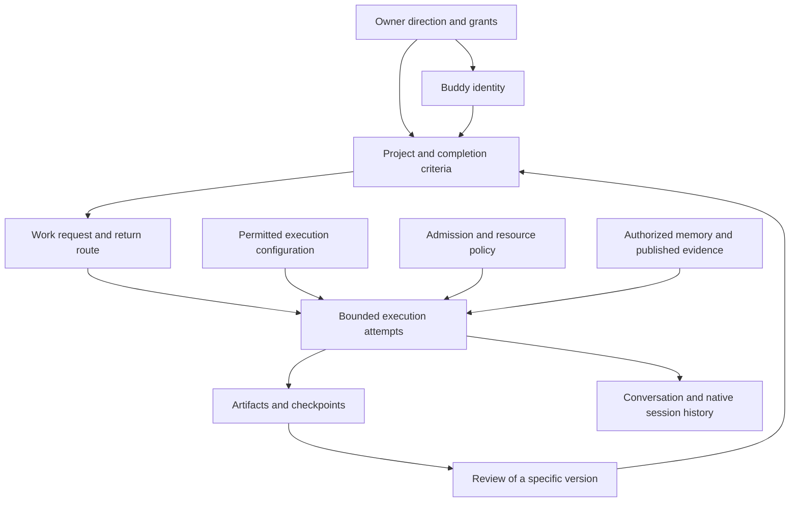

# Meta synthesis: one coherent Buddy design across the handoffs

September 13, 2026. Prepared by Buddies Development Lead for the owner's requested review.
This is a reasoned proposal, not an accepted replacement contract or an implementation report.

## 1. The common design question

All four substantive handoffs ask how an employee can remain responsible and available
while the machinery doing its work changes. The owner wants to reach a Buddy during busy
periods, use different models for different jobs, delegate to workers that remember between
runs, and let difficult work continue without repeatedly asking a human for more time.

These are related needs, but they do not require every resource to become one object. The
most coherent design gives each fact one authority and makes their relationships explicit:

- **Buddy identity** answers who is responsible and where messages are addressed.
- **Project/todo criteria** answer what remains to be accomplished and what counts as done.
- **Messages and receipts** answer what was requested, by whom, and where the response belongs.
- **Audience-scoped documents and checkpoints** answer what knowledge and evidence can travel.
- **Execution attempts** answer what process currently has authority and what actually ran.
- **Execution configuration** answers which provider/model/settings an attempt used.
- **Admission and resource policy** answer when work may run and what it may consume.

The existing resource-consolidation decision is still a strong foundation. The new emphasis
is to complete the semantics between those resources. A single creation service is helpful,
but it does not by itself define foreground entitlement, renewal accounting, archival access
or whether a delivered result has been reviewed. [S17](08-source-evidence.md#s17),
[S19](08-source-evidence.md#s19)

## 2. What the combined record supports

The handoffs report a clear owner direction on foreground access and a clear preference for
controls that do not routinely interrupt hard authorized work for human approval. They also
describe interest in durable lightweight workers and model-separated delegation. The exact
per-job API, 16/24 global-concurrency suggestions, one-child-per-assignment recommendation,
automatic archival and aggregate renewal policy remain assistant proposals.

The current implementation has substantial ingredients: ordinary persistent Buddies, durable
projects and messages, scoped knowledge, independent memory review, inert shared conversation
creation, bounded work chains, checkpoints, structured observation and supported linked
recovery. It also has a directly corroborated foreground capacity coupling and no model
override in the native managed-work schema. The current contracts explicitly do not enforce
measured dollar budgets. [S02–S06](08-source-evidence.md#s02), [S23](08-source-evidence.md#s23),
[S25](08-source-evidence.md#s25)

Some older memory describes the five resource-consolidation defects as still open. Newer
repair reports record passing desired-behavior regressions, and the history report includes
live recovery follow-up. The right conclusion is to preserve those fixes and verify the new
journey, not to reopen every historical defect as though no work followed. Conversely, a
list of passing package tests does not establish that the multi-day delegated worker journey
already works smoothly. [S20](08-source-evidence.md#s20), [S22](08-source-evidence.md#s22)

Handoff 3 is empty. The synthesis makes no assumption about what it might have contained.

## 3. Overlap matrix

| Shared concern | Foreground capacity | Model delegation | Assignment workers | Renewable allowance |
|---|---|---|---|---|
| Identity versus process | Owner can reach the same Buddy during other runs | Different model does not imply different employee | Identity survives sleeping processes | New tranche does not create a new employee |
| Task versus attempt | A queue wait is not task failure | Criteria survive model changes | One assignment spans several runs | Completion is not tied to an estimate |
| Authority versus transcript | Foreground classification must be trusted | Profile selection does not widen tools | Reopening a chat does not revive claims | Renewal preserves stop/revocation boundaries |
| Admission class | Foreground does not share background denial | Model price does not determine class | Sleeping identities occupy no process slot | Resource availability gates autonomous start |
| Context and memory | Owner audience stays separate | Compact authorized packet, selective retrieval | Scoped learning persists between runs | Checkpoints enable safe continuation |
| Configuration provenance | Effective limits explain blocked starts | Requested/resolved/actual values differ | Provider sessions may rotate | A new tranche records deliberate config changes |
| Budget lineage | Background budget does not block owner discussion | Include lead/worker/review effort | Creating a child does not mint allowance | Retries and children share the selected aggregate |
| Return and review | Human chat returns stay in Mailbox | Lead review needs an admitted background route | Same worker receives versioned feedback | Parent needs allowance to review/renew |
| Visibility | Stable accepted input and specific wait | Show actual model used | Find idle workers and completed artifacts | Show unit, consumption, cause and controller |
| Completion evidence | No failure storm masquerading as progress | Correct artifact matters more than model label | Archive follows settled work | More effort is justified by useful evidence |

The highest-value shared work is therefore not a universal “sub-buddy” primitive. It is a
coherent relationship between work ownership, scoped context, admitted execution and honest
resource accounting.

## 4. The lifetimes should remain separate

The following is a conceptual relationship diagram, not a new database schema:

This model permits several natural combinations. One Buddy can own multiple projects.
One project can receive a successor obligation after a prior bounded request ends. One
obligation can have multiple attempts. A provider change can start a new native context
without changing the responsible Buddy. A worker can be idle while a review obligation
remains open. A project can retain evidence after the worker is archived.

Each relationship has constraints. A distinct request should not create a competing active
managed obligation on the same project. A successor must preserve cancellation and accounting
lineage. A context change must respect disclosure boundaries. A new owner request can create
new authority, but historical notes and a recognizable conversation ID cannot do so.

The practical benefit is that every new feature does not require a new noun. At the same
time, “reuse primitives” must not become an excuse to leave essential facts in prose. If
renewal needs an atomic aggregate account, it needs an authoritative durable representation.
The simplicity criterion is one source of truth per fact, not zero new columns forever.

## 5. Ten tensions that the isolated handoffs leave unresolved

### 5.1 Foreground entitlement versus universal FIFO

Foreground access during background saturation requires a separate admission class or
reserved capacity. Universal FIFO across all requests can prevent that. Define deterministic
ordering among eligible comparable requests, preserve same-conversation order, and make
cross-class priority explicit. A paused older background request must not block every later
runnable request. The original non-FIFO incident is a timer-race defect, not proof that one
global queue is the correct architecture.

### 5.2 “Never block owner chat” versus finite host resources

The application can remove background policy denial and reserve foreground headroom. It
cannot promise a finite host will execute infinitely many owner sessions. Keep the product
guarantee specific: background budgets and limits do not block the owner's eligible chat.
If an actual host emergency remains, expose that cause through a distinct policy. Do not
silently kill admitted workers to manufacture responsiveness.

### 5.3 More cheap workers versus real aggregate control

A lower inference-cost model can justify more parallel work only after measuring quality,
process pressure and review overhead. It does not grant more total authorized spending,
more memory or a larger server. Excluding foreground from background counts, configuring
global concurrency and implementing aggregate budgets are separate changes. The handoff's
16/24 numbers should not slip into a default merely because they sound modest.

### 5.4 Persistent memory versus private audience isolation

The worker should remember relevant learning, but neither a shared identity nor a manager
edge makes every memory document readable in every turn. “Own memory” must identify audience
and author. Publish bounded briefs and checkpoints deliberately. Preserve the existing
filter-before-pagination and receipt privacy rules so scaling delegation does not recreate
the prior leak through metadata rather than document bodies.

### 5.5 Continuity versus immortal provider sessions

Durable identity and evidence can survive a process exit or safe context rotation. Native
session continuity is conditional on compatible provider state and authorized disclosure.
Visible history must remain intact even when execution starts fresh. Promising “the same
worker tomorrow” should not promise reuse of an unverified session after a crash or access
revocation.

### 5.6 Archive convenience versus future addressability

Current archive hides ordinary Buddy navigation and cancels outstanding execution. A worker
expected to answer tomorrow should generally remain active but idle. Automatic archive after
completion requires an independently discoverable artifact/history view and a selected
reactivation policy. Retaining bytes in storage is not sufficient user-facing continuity.

### 5.7 Automatic lead review versus human-chat mailbox behavior

The current contract correctly treats an owner chat as a human control point. Results can
arrive in its Mailbox without starting a model. The cross-model loop needs a background
lead obligation if review is to occur autonomously. A sender's source chat ID alone is not
proof that a model will consume the result. Completion, delivery and review must remain
separate observable facts.

### 5.8 Renewable child effort versus an exhausted parent

A manager whose own elapsed envelope ended while the child worked cannot simply wake to
grant more time. The proposed allocator needs a defined management path and resources for
review. Options include reserved coordination allowance or another authorized review
controller. This is not solved by giving each child a large independent budget; doing so
can create unbounded descendant consumption and abandoned results.

### 5.9 Autonomous continuation versus terminal authority

The owner's preference reduces routine human intervention, but does not invalidate the
single-owner and drain decisions. Continuing after a clean checkpoint, recovering after
uncertain effects, renewing an estimate, and expanding owner scope are different operations.
A new request key must not launder exhausted resources or revive a stopped root. Existing
failed receipts remain historically true after a successor succeeds.

### 5.10 Minimal primitives versus invisible new authorities

It is tempting to keep all new policy in prompts to avoid schema changes. That would make
balances, renewal rights, archive eligibility and profile overrides depend on whichever
agent most recently summarized them. It is equally tempting to build a universal workflow
engine. The preferable middle is to extend existing authorities where possible and add a
small new durable fact only when its transactional invariant cannot be expressed otherwise.

## 6. Proposed common design principles

**Owner availability is an admission guarantee.** Keep foreground access independent of
background activity limits, while preserving trusted origin and authority checks. Do not
inherit foreground status into autonomous descendants.

**Work owns completion; attempts supply evidence.** A successful provider turn can leave work
unfinished. A failed attempt can save valuable progress. Completion follows current project
criteria and actual artifacts, not a model's final sentence or the termination of a process.

**Identity outlives execution, and need not outlive its assignment forever.** Reuse ordinary
Buddies for standing staff and assignment workers. Avoid a new identity for every attempt.
Represent idle/waiting state through existing work and run facts where possible.

**Execution selection is explicit and historically inspectable.** Reuse canonical provider
configuration, retain requested intent and effective attempt snapshots, and make changes
apply at safe boundaries. A model choice does not change the employee's identity or grants.

**Context crosses a handoff by authorized publication and retrieval.** Give workers concise
criteria and evidence pointers, with access to relevant detail. Do not use whole manager
transcripts as the default transport. Memory documents and work records have different jobs.

**Resource controls name their unit and scope.** Concurrency is not budget, elapsed time is
not compute, and stored token fields are not measured dollars. Select aggregate accounting
before claiming automatic renewal respects an overall ceiling.

**Routine waits are durable eligibility states.** A waiting request does not need a new
failed attempt every second. Capacity release, due time and child results should reconcile
existing work through the authoritative scheduler path, with idempotent recovery scans.

**Renewal is delegated resource authority, not resurrection.** A manager may extend a tranche
within a granted outer envelope. Claims, cancellation, stopped roots and effect inspection
still apply. New work cannot reset consumption accidentally.

**Delivery is not review.** Preserve message, execution, artifact and consumer-verdict evidence
separately. The UI should show what happened, what remains and who can act without deriving
success from a convenient status flag.

**History is evidence, not current permission.** Preserve earlier decisions and failed runs,
and append successors when requirements change. A working tree, archive, loaded backend and
real production journey are distinct verification layers.

## 7. A full target journey that exercises all four handoffs

Imagine the owner asks the Development Lead to repair an export defect, delegate execution
economically and finish after review, while the owner continues discussing another issue.

| Stage | User/work outcome | Required underlying fact |
|---|---|---|
| Owner opens chat while background is full | Conversation starts and input stays visible | Trusted foreground class independent of background cap |
| Lead defines work | Criteria and existing evidence are clear | Revisioned recipient-owned project/todos |
| Lead chooses worker | Standing engineer or assignment-lived child is selected | Ordinary Buddy identity; authorized staffing/reuse |
| Lead chooses execution settings | Worker uses the intended permitted profile | Canonical selection intent and immutable attempt snapshot |
| Lead hands off | Worker gets a compact sufficient packet | Explicit audience, readable versioned refs, original request |
| Worker investigates | Useful experiments and saved output accumulate | Current criteria, bounded execution and checkpoints |
| Initial estimate is reached | A manager judges the next useful tranche | Progress evidence and delegated aggregate renewal authority |
| Worker needs review | Process exits; identity and work remain | Drained claim, durable waiting obligation, no held slot |
| Result arrives | Background lead resumes to review | Eligible parent route and reserved/remaining management allowance |
| Lead requests a revision | Same worker continues with targeted feedback | Artifact version, current criteria, same responsibility |
| Owner returns tomorrow | Lead can explain state without restarting work | Foreground availability, durable evidence and honest current receipts |
| Work is accepted | Final artifact and verdict are recorded | Completion evidence plus consumer review |
| Worker is retired if appropriate | Roster stays usable; artifact remains findable | Explicit archival policy and independent history access |

The journey is a target scenario, not a current-product claim. Several stages already have
implemented building blocks. Per-assignment model selection, aggregate renewal and lightweight
archival discovery need additional design/implementation. The whole scenario should eventually
be verified through real package/runtime boundaries and a bounded actual-provider workflow.

A useful variant is direct self-background work. The lead may keep the same Buddy identity
and delegate execution to a different profile without creating a child, if separate durable
ownership is unnecessary. Another variant uses an established engineer with reusable domain
memory. The system should support these choices without forcing every background invocation
into the same staffing pattern.

## 8. UI implications: show the assignment and its explanation

The user primarily needs to know who owns the work, what it is trying to produce, what is
happening now, why it is waiting, and where the evidence is. A task/assignment view can show
the responsible Buddy and current execution summary without making process IDs the primary
navigation model.

Foreground chats should retain accepted input and show same-thread waits clearly. Background
work should show a reason such as capacity, scheduled time, child review, explicit pause,
recoverable failure or exhausted allocation. Each cause should name the appropriate action
or next eligibility. Do not present every hold as “ask owner,” or every stopped process as
an unfinished task that can be blindly restarted.

Execution details should distinguish the current Buddy defaults from the profile that ran.
Resource details should show actual units and unknowns. Review details should identify the
artifact/version and verdict. Completed artifacts should remain reachable even when a child
leaves the active directory. Desktop and mobile should share these projections and semantics.

Avoid exposing implementation plumbing in the ordinary flow. The user action can be “Delegate
this task,” “Review result,” or “Continue within team allowance,” while the system composes
existing resources and retains exact receipts for inspection. Fewer visible controls are
valuable only when their combined effect is clear and their authority remains correct.

## 9. Architectural alternatives

### A. Independent patches with current fixed envelopes

Fix foreground counting, add raw model fields, add a create-child shortcut and increase
duration defaults. This is quick and may relieve immediate pain, but it leaves budget
lineage, parent review, archive access and session semantics unresolved. It is appropriate
only for the narrow foreground defect as a standalone repair, not as the full design answer.

### B. Compose and strengthen existing resources — recommended

Keep ordinary Buddies, projects/todos, messages, scoped documents, attempts and the existing
executor. Add explicit admission classification, reused execution selection, lifecycle
composition and a real aggregate allocation authority if renewal is selected. Improve
projections and end-to-end tests around those boundaries.

This follows the earlier consolidation reasoning while acknowledging necessary new facts.
It has a migration cost, especially for duration semantics and historical execution snapshots,
but avoids replacing every successful resource path merely because the workflow is broader.

### C. A distinct ephemeral-worker resource

Introduce a worker type with its own memory, address, runs and archive behavior. This may
appear lightweight, but duplicates most Buddy semantics and demands bridges for grants,
messaging, work ownership and retention. Reconsider only if ordinary Buddies cannot express
a concrete permission, isolation or lifecycle requirement cleanly. Short useful lifespan
alone is insufficient evidence for a second identity system.

### D. A general workflow engine or event-ledger replacement

Make workflow cases/steps the new authority for tasks, retries, approvals and dependencies.
This could serve repeated formal processes, replayable multi-consumer subscriptions or
complex dependency templates. The supplied handoffs do not demonstrate that requirement.
It would add migration and dual-authority risks before fixing the directly observed defects.
The September 12–13 decisions preserve similar alternatives for reconsideration rather than
selecting them now. [S17](08-source-evidence.md#s17), [S19](08-source-evidence.md#s19)

## 10. Recommended sequence, with independent work separated

This is proposed design sequencing, not a staffing plan or a replacement for native work
records. Existing ownership and completed repair evidence must be consulted before creating
implementation tasks.

**First, repair the foreground defect and preserve accepted input.** The owner rule is clear,
the source path is concrete, and this does not depend on a future budget allocator. Define
capacity class and scope, replace the failure loop and keep current timeout/privacy guards.

**Second, settle shared terminology and execution provenance.** Use the lifetime model,
requested/effective configuration, reasoned waiting and distinct result/review facts. Some
projections already exist; improve gaps rather than build another observation authority.

**Third, add per-assignment execution selection through canonical config.** This can proceed
without automatic staffing or renewable budgets, provided bounds and limitations remain
honest. Test defaults, unavailable selections, provider-session changes and immutable history.

**Fourth, specify and implement aggregate renewal if selected.** Choose scope, unit, atomic
reservation, management allowance and cancellation precedence before promising autonomous
extensions. Do not simulate this by raising every child limit or repeatedly issuing fresh
work requests after exhaustion.

**Fifth, make the assignment-worker workflow lightweight.** Compose authorized creation/reuse,
project context, model selection and return review. Keep workers idle while follow-up is
expected; add archival discovery before enabling automatic cleanup. This UI composition
benefits from stable renewal and visibility semantics, though basic reuse can ship earlier.

**Finally, evaluate the full journey and tune concurrency.** Measure outcome quality, latency,
process occupancy, review effort and available usage data. Select higher concurrency only
with evidence. Package parity and unit tests are prerequisites, not a substitute for the
original owner/lead/worker/return experience.

## 11. Questions that remain actual choices

The decision register expands these, but the most consequential choices are:

1. Is per-Buddy concurrency global across workspaces or per membership, and what separate
   host headroom guarantees foreground availability?
2. Does an omitted assignment profile pin defaults at acceptance or follow later defaults,
   and how are intentional changes versioned?
3. What aggregate resource unit and scope can be enforced honestly in the first renewal
   release, and how is management/review effort reserved?
4. Which waits consume a calendar deadline versus active effort, and how do old envelopes
   retain their original meaning?
5. What authorizes manager renewal, what trips intervention, and how are uncertain effects
   reconciled before a successor starts?
6. When is a child appropriate versus a standing employee, and how are archived results
   discovered without silently reactivating work?

None requires stopping this documentation review for an immediate owner answer. They are
the choices to make before dependent implementation or claims of full lifecycle support.

## 12. Reflection on the large dump

The strongest pattern is that locally reasonable safeguards became accidental product
policy. Sharing one capacity guard was economical, but it made an employee unreachable to
the owner. Giving work a fixed envelope prevented indefinite execution, but it made waiting
and difficult work compete with a clock that was not a spending meter. Keeping helpers
turn-scoped simplified identity, but the explanation obscured ordinary Buddies that need
only last for an assignment.

Another pattern is confusing the existence of primitives with the reliability of their
composition. A saved worker, a memory document and a send tool do not prove a worker can
sleep through review and resume safely tomorrow. A reply receipt does not prove a lead
reviewed an artifact. A stored model string does not prove the process used it. The remedy
is an explicit consumer journey with evidence at each boundary, not just more feature lists.

The earlier architecture's best decisions remain valuable: one execution owner, terminal
history, canonical work criteria, shared creation separate from admission, scoped knowledge,
and append-only decision evidence. The new owner emphasis changes availability and autonomy
policy. It does not require weakening those foundations.

The most promising product direction is therefore an employee system in which durable
responsibility is cheap to retain, execution is temporary and deliberately configured,
resource estimates can be renewed within real authority, and the owner can always reach
the people responsible. The next design should make those relationships ordinary and
predictable rather than presenting each one as a separate advanced feature.
