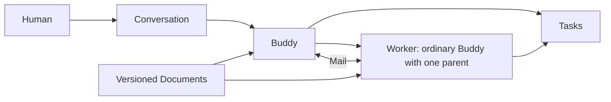

# Buddies and Workers — v2

September 13, 2026. Proposed design by Buddies Development Lead, revised after
[v1](01-v1.md) and [reflection](02-reflection.md). The owner requested the design
and critique. The precise APIs, policies and defaults below are assistant
recommendations, not yet owner-accepted or implemented.

Read this as the complete target design. [MCP contract](04-mcp-contract.md) defines
every tool and its role; [code and removal map](05-code-and-removal-map.md) maps the
target to current files. [Source evidence](source-index.md) pins the inspected
versions. Current normal employee MCP has 25 tools; the target union also has 25,
with smaller role-specific catalogs. No performance improvement is claimed from
that count.

## The design in one paragraph

A person talks to a Buddy. The Buddy defines Tasks and gives related work to a
temporary Worker, which is an ordinary Buddy under one parent. The Worker keeps
its identity and compatible context across Tasks, reports progress automatically,
and stops for a required review after a bounded solo session. Its parent inspects
the work and explicitly continues, redirects or stops it. Mail carries
correspondence. Prompt requests execution. Task state owns the outcome. The host
owns clocks, delivery, admission, cancellation and execution receipts.

## 1. Five product objects

| Object | Owns | Does not own | Canonical implementation |
|---|---|---|---|
| **Buddy** | Identity, role, model preference, lifecycle, relationships | Task completion, a provider process's lifetime, resource authorization | Existing Buddy and canonical manager relationship |
| **Task** | Outcome, accountable owner, criteria/checklist, candidate, acceptance, blockers and evidence | Worker lifetime or provider session; a second message completion status | Existing `owned_projects` and `buddy_todos` |
| **Mail** | Sender, recipient, body, thread links, permitted evidence and delivery history | Execution permission, task completion, implicit waiting | Existing durable Buddy message store |
| **Document** | Named content, audience and immutable versions | Live work status or authority to act | Existing knowledge/document infrastructure |
| **Conversation** | Human-initiated interaction, saved discussion and display history | Background scheduling or Worker authorization | Existing conversation/config/runtime infrastructure |

**Worker is a Buddy mode.** Add an explicit ordinary/worker discriminant to Buddy;
the worker branch requires exactly one canonical manager edge. Do not store a
second parent ID with its own interpretation. Creation plus that edge is atomic.
Worker parentage is fixed for its temporary work relationship. Task reassignment
does not reparent the Worker. Existing permanent direct reports stay ordinary.

| Difference | Ordinary Buddy | Worker |
|---|---|---|
| Relationship with the person | Standing named colleague; ordinary roster entry | Temporary helper inspected under its parent |
| Normal autonomous work | Short coordination, planning, review and responses | Sustained implementation on assigned related Tasks |
| Lifetime | Independent of a particular body of work | Retained through that work and feedback; explicitly retired afterward |
| Execution | Human conversations plus authorized background coordination contexts | One work lane across all compatible saved contexts |
| Supervision | Owner/manager directions and granted policy | Parent, automatic check-ins and required solo-session review |
| Infrastructure | Buddy identity, scoped knowledge, Mail, configuration and executor | Exactly the same infrastructure, with Worker policy |

An ordinary Buddy can be a permanent specialist or a lead. In this proposed
operating model, substantial autonomous implementation uses its Worker rather
than turning a short coordination response into an unbounded work loop.

**Task is the work resource currently called an owned Project.** Use Task in the
new UI and `new_task`/`update_task` MCP. Preserve IDs and storage. A Workspace is
the repository/team scope; do not rename it Task. Checklists remain embedded
criteria, without independent executors. Use the existing parent-task relation
for decomposition; this proposal does not add an arbitrary dependency graph.

**Document is a resource family.** Soul, working memory, long-term memory, shared
briefs and append-only notes have different write permissions and retention rules.
They share versioned references, not a permission rule. Code commits, external
URLs and binary artifacts can remain external evidence references. No new
Document service or mandatory editor is needed.

All arrows are subject to existing scope and grants. In particular, a parent
does not inherit private Worker memory, and a Worker does not inherit the human
conversation that requested its creation.

## 2. Necessary supporting records, kept explicit

Five product objects do not mean five database tables. These records answer
different operational questions and must remain inspectable:

| Record or value | Question answered | Rule |
|---|---|---|
| Workspace membership and grants | Who may see, change, dispatch or staff? | Existing host-bound authorization; role/tool visibility cannot grant permission |
| Context binding | Which identity, audience, configuration and provider history are compatible? | Existing durable background conversation/config binding, with explicit task references and authority provenance |
| Execution request | What authorized input should run? | Durable input identity independent of Mail; sources can be a Prompt, report cause or schedule occurrence |
| Solo session | How much admitted work may this Worker do before another required review? | Durable elapsed clock/revision, spanning multiple provider attempts and Tasks |
| Attempt / run | Which executor actually ran, with what settings and result? | Existing claimed run, private token, immutable terminal receipt and drain ownership |
| Authorization account and policy | What cumulative effort and operations remain available? | Host-issued root lineage, reservations and one versioned resolver |
| Checkpoint | What was saved, done, uncertain, and needed to resume? | Existing versioned artifact/effect attestation; not proof the artifact remains unchanged |
| Pending cause / delivery intent | What attention is owed, and was it delivered/handled? | Existing coordination delivery machinery extended transactionally; no model-owned second queue |
| Schedule | When does previously authorized work become eligible? | Existing definition/occurrence; it supplies input to the shared execution path |

The context binding stores one active work binding: permitted audience, related
Task references, authorization reference and current session reference. This is
the minimum execution relationship; it is not a new user-authored Assignment or
Batch with its own completion state. Multiple incompatible bindings can be saved
for one Worker, but only one can execute work at a time.

The execution request needs a durable row or equally explicit normalized
representation. Reusing `buddy_runs.input_key` does not magically supply the
missing request lifetime. Extend the canonical package, keeping the existing run
and receipt infrastructure. Do not put an open Mail message back underneath it as
the real work authority.

## 3. One Worker, several related Tasks, one writer

A parent can create a Worker for “budgets and Worker implementation” and give it
two separately reviewable Tasks. The Worker can use what it learned on the first
when doing the second. Completing one Task leaves the Worker and second Task
intact.

The runtime enforces **one active work executor per Worker across all contexts**,
not merely one process per conversation ID. Retain that fence until the process
exits and its event stream drains. Queued follow-ups, restart recovery and task
handoffs cannot acquire another writer early.

Related work shares one explicit existing audience and root authorization. The
normal case is sibling Tasks sharing a parent Task's audience and brief. Access
to several Tasks does not implicitly union their private conversations. Do not
pick the first Task ID as the audience. Incompatible audiences or providers use
separate saved contexts, serially, with a deliberate host-validated handoff.

Use the current authority/audience generation fence for context reuse. New
permitted learning can update a brief without discarding useful history. Revoked
access or incompatible configuration forces a fresh authorized context. Provider
model/effort selection uses the canonical configuration resolver and passes
provider-owned values through verbatim.

An ordinary lead has one short coordination lane per compatible scope. These
turns read evidence, review, plan, update work and prompt Workers. Long-running
implementation belongs to Worker Tasks. A Worker granted responsibility for
subordinates performs coordination within its same work lane; it gets no extra
background writer or private authority merely by becoming a lead.

## 4. Mail delivers; Prompt executes

`mail` delivers internal correspondence and returns a Mail receipt. A reply is
Mail with `replyTo`, so the new catalog has no separate `reply` tool. Mail does
not require a model response, wait for execution, reset a timer or complete a
Task. Plain Mail cannot revive an archived Worker.

`prompt` is the single execution command. It returns a durable request ID and
current admission state. It can start Worker work, add an input to an existing
lane, continue a session after required review, or recover an inspected failed
attempt. The discriminated inputs in the MCP contract make those effects
explicit. No `assign_work`, `continue_worker` or `retry_run` tool is exposed in
the new catalog.

One short Prompt to an ordinary Buddy asks it to coordinate or answer. Sustained
implementation must name Worker-owned Tasks. Ending a turn settles its attempt;
it does not settle the Tasks. A Prompt result can be observed in its receipt and
delivered to its recorded requester. The return route is a logical permitted
background destination, not a requirement that the original process is still
alive.

Routine Mail does not wake a model. Explicit Prompts, blocked/review-ready Task
reports, required session review and actionable execution failures do. The host
persists and deduplicates those causes. A short coordination turn consumes a
bounded snapshot of causes. Causes arriving after that snapshot remain pending
for another turn. Merely fetching the inbox does not mark a required decision
handled.

Mail requesting information does not suspend an entire batch. A Task that cannot
proceed records its specific blocking reason and Mail/request reference. Other
runnable Tasks continue within the same session. The lead never occupies a
provider slot while waiting for its Workers to finish. Returning a coordination
turn is normal; the next result can wake its next turn.

## 5. One report operation, no Report object

`report` saves existing records in one canonical transaction. Task changes use
their revisions; the checkpoint records saved artifacts and known/uncertain
effects. The same transaction saves the required Mail and wake intent. If any
revision or permission check fails, none of those writes commit.

| Report kind | Durable effect | Execution effect |
|---|---|---|
| `checkpoint` | Checkpoint only | Continue; no Mail and no parent wake |
| `progress` | Checkpoint and internal progress Mail | Continue; no routine parent model turn |
| `blocked` | Checkpoint, affected Task blockers, Mail and decision cause | Hold those Tasks; wake parent; other eligible Tasks may continue |
| `ready` | Checkpoint, exact candidate evidence and affected Tasks in review, Mail and decision cause | Hold those Tasks for acceptance; wake parent; others may continue |

The standalone checkpoint tool disappears from the new catalog. `report` is a
justified composition because partial success could strand required attention;
it is not a generic transaction language.

The Worker submits a candidate for a Task. Its parent accepts the exact candidate
revision through `update_task(status:"done", acceptance:...)`. The same Task
records who accepted which criteria/evidence version. The Worker cannot approve
its own review-required result. Checklist completion still requires evidence.
Changes to criteria or candidate after submission invalidate that acceptance
attempt. Existing `accepted_by` records assignment acceptance and must not be
reinterpreted as artifact acceptance.

No duplicate Review object, `submit_review`, or magic final-answer marker is
needed. The parent can accept one Task while asking for revisions on another.
Task acceptance does not itself renew a solo session or retire the Worker.

## 6. Automatic check-ins from a permitted snapshot

The owner's fork-and-email idea is preserved as a behavior: periodically produce
a contextual report while the original Worker continues, then deliver it to the
parent. The default implementation is a **fresh restricted reporting execution
over a saved snapshot**. Native provider forking is an optional optimization.

The host captures a transcript/event watermark, snapshot time, current Task
revisions, previous report watermark and latest permitted checkpoint. The input
includes only content the parent may receive. It explicitly identifies pending
tools, truncated history and unknown effects. The report says what changed,
what evidence supports that statement, what is blocked, and what the Worker last
intended to do. It cannot invent a newer commitment for the live Worker.

The reporter gets no Buddy MCP, shell, browser, file mutation, staffing, renewal
or delivery tool. It returns a bounded structured report; the host validates and
delivers it to the fixed parent using the captured authorization. Credentials and
recipient selection are never entrusted to generated text. Recheck recipient
access and cancellation before delivery. A report is supervision evidence, not
an independent audit of whether the Worker is correct.

Use the existing restricted memory-review runner as a lifecycle precedent, with
a separate reporting mandate and receipt. Do not give the reporter a Worker
identity or run another memory reviewer after it. Do not refactor the successful
memory-curation policy or change its model as an incidental part of this work.

A native fork is eligible only when a real boundary test proves a stable snapshot,
compatible audience and replacement of inherited capabilities/instructions. A
provider's generic “supports fork” flag is insufficient. If that is unavailable,
the saved-snapshot path remains the intended product behavior. If reporting cannot
run, show the last real checkpoint and overdue/failure reason; never present a
synthetic liveness receipt as a successful progress report.

Allow at most one reporting execution per Worker. Coalesce missed intervals to
the newest snapshot, keeping an overdue indication until a successful report.
Generation and delivery are separately receipted so a delivery retry does not
rerun the model. Reports do not recursively trigger more reports.

## 7. Clocks, review and continuation

The canonical package resolves one versioned policy. The host supplies explicit
configuration; preview, admission, timers, receipts and both UI shells consume
the resolved result. A policy ID alone is not an allowance; the authorization
account supplies the actual remaining allocation.

Recommended initial preset, **new assistant proposal for evaluation**: check in
every 5 minutes of admitted work; require review after a 30-minute solo session;
cap a reporting execution at 60 seconds and a lead coordination turn at 120
seconds. These are tunable starting values, not owner-selected defaults or
measured optimums. Existing foreground `TURN_MAX_RUNTIME_MS` stays explicit and
separate. Outer resource totals come from explicit authorized bounds, never a
new hidden one-hour default.

Solo time counts admitted Worker execution, including running tools. It spans
provider turns, retries and task switches. Drained waits and queue time pause
the clock without resetting it. Reporter/lead execution counts as coordination
effort, not solo Worker time. An optional calendar deadline keeps advancing
during waits. Persist accrued time and admission segments; after a crash, retain
uncertain consumption/reservations until conservative settlement instead of
pretending nothing ran.

When a check-in succeeds, only the next check-in obligation advances. At the
maximum solo session, the host atomically marks that session held and records a
required-review cause and delivery intent. It fences work effects and drains the
executor. Checkpoint proactively before the boundary when the provider can
cooperate. If it cannot, retain the last checkpoint and true timeout/cancellation
receipt; do not invent a final Worker-authored report.

A parent continuation names the held session revision, reviewed causes, exact
Task versions, its next instruction and a bounded next session. The package
checks current grants, stop/revocation fences, drained ownership and remaining
authorization. It records the decision, allocation and one eligible request in
the same transaction. Replaying that command returns its receipt. A stale command
cannot grant another session; a newly arrived cause remains pending. Neither Mail
delivery nor an acknowledgment is a continuation.

Recovering a failed provider attempt is narrower: inspect its checkpoint/effects,
then issue `prompt(recover)`. It preserves the original session clock and account.
If the solo session is exhausted, recovery returns `review_required`; an explicit
parent continuation is necessary. Terminal attempt receipts remain terminal.
Stopping the root or revoking authority wins over both operations.

### Aggregate effort and capacity

Use active provider wall seconds summed across executing attempts as the initial
enforceable resource unit. This includes useful work, tools and provider stalls;
it does not claim to measure productivity or dollars. A root covers Worker work,
descendants, report generation and parent coordination. Reserve work and the
maximum reporting/review overhead before granting a session. Settle actual usage
after drain and return only demonstrably unused reservations.

`consumed + outstanding reservations <= authorized total`

For a 30-minute session with 5-minute check-ins, conservatively reserve up to six
60-second reports and one 120-second required review in addition to the Worker
allocation. A shorter feasible grant may be chosen; never silently borrow outside
the root. Additional early reviews also need a reservation. If they cannot run,
retain the decision cause and reason. Memory maintenance is explicitly shown as
host-maintenance usage under its existing mandate, rather than disappearing from
an alleged all-system total. Harness helpers need accounted usage or a defensible
enforced reservation; disable unbounded helper paths in a hard-limited profile.

Separate background work occupancy from coordination occupancy. Reserve review
capacity within the configured background total and prioritize required reviews
over routine reporters. If only one background slot is configured, draining a
Worker gives its review priority before new work; automatic reports may show
overdue while capacity is occupied. Never hold a Worker slot while awaiting its
parent. Foreground chat bypasses these background quotas and rate limits. Actual
host/provider failure still produces an honest error; this promise cannot create
physical capacity outside the machine or provider.

The UI shows one Limits projection: last/next check-in, solo time remaining,
required review, account remaining, coordination reserve, optional calendar
deadline and exact hold/stop reason. Historical compatibility policy remains
labeled with its original elapsed-time units.

## 8. Pause, acceptance and retirement

| Situation | Task | Worker/session | Parent action |
|---|---|---|---|
| Routine progress | Remains in progress | Continues within existing session | Read when useful |
| One Task blocked | That Task records blocker | Other eligible Tasks can run | Resolve, revise or leave visibly blocked |
| Candidate ready | That Task enters review | Other eligible Tasks can run | Accept exact candidate or return changes |
| Solo session ends | Unfinished Tasks retain their state | Held for required review; process drains | Continue with a new bounded session, replan or stop |
| Provider failure | Evidence and uncertain effects retained | Attempt terminal; work held for inspected recovery | Recover within remaining session or review for continuation |
| All Tasks accepted | Tasks done | Idle; no new work is inferred | Retire, or explicitly give further related work |
| Owner stop/revocation | Retains truthful outcome | Fenced and drained | New keys, retries or Mail cannot revive it |

Retirement is explicit. `retire_buddy` uses the same archival implementation for
Workers and ordinary direct reports, with different verified authority. A parent
may retire its Worker within the owner-granted Worker-management mandate. Retiring
a standing Buddy retains today's stronger profile/execution grant checks.

Before retirement, require no unresolved owned Tasks, actionable decision causes,
eligible input, active process or memory-maintenance writer. Task transfer is an
explicit revisioned handoff which drains the old writer; retirement does not
silently orphan or bulk-complete work. Ordinary informational Mail need not block
retirement. Retain parent-visible operational history and authorized artifacts
after retirement. Late Mail is preserved and produces at most one appropriate
parent notification, without restarting the Worker or disclosing private memory.

Do not automatically convert, retire or hide standing direct reports. If a parent
is archived, its Workers are held and visible to the owner for disposition; they
are not promoted into the public roster by the existing ordinary-report rule.

## 9. What each participant sees

An ordinary Worker turn gets 12 tools: scoped work reading/updating, inbox/Mail,
documents/notes, reporting, team observation and stopping its own work. A lead
coordination turn gets those plus six task/staffing/dispatch tools. Seven existing
administration/diagnostic tools are attached only in the relevant authorized
profile. The [full MCP contract](04-mcp-contract.md) lists the complete 25-tool
union, arguments, results, side effects, permission checks and compatibility map.

These profiles are discovery defaults. The host intersects them with saved run
policy, current grants, audience and lifecycle before exposing tools, then checks
again at each mutation. A Worker explicitly granted a lead role can get the
management profile without acquiring another lane. Existing independent grants
are not revoked merely because the default catalog is smaller. Owner team setup
and Builder MCP remain separate privileged surfaces.

The Worker startup brief contains its identity/role, parent, current binding,
authorized Tasks and criteria, compatible audience, latest checkpoint, pending
inputs, actual limits and exact resource references. It omits the owner's private
chat, unrelated backlog, credential material and repeated tool manuals. The parent
brief includes pending causes and supervised work summaries, expanding evidence
on demand. Truncation and pagination remain explicit.

On desktop and mobile, Workers appear beneath their parent and on their assigned
Tasks. Selecting one shows work, permitted transcript history, reports, remaining
session and waiting reason. Human chat keeps its existing route and immediate
input behavior. Background transcripts reuse existing storage and rendering,
but appear in Worker/coordination inspection rather than the normal human-chat
list. No second WS connection or conversation engine is introduced.

An owner may inspect or discuss a Worker's work without taking its active work
context. Any instruction that changes running work is routed into that Worker's
lane or an explicit stop/handoff. The chat can acknowledge the queued instruction
immediately; it does not wait for background capacity or create a second writer.

## 10. Existing cases this design must cover

- **Schedules:** existing definitions and occurrence identity remain. New work
  schedules prompt a lead with their saved authority, or instantiate a previously
  authorized Task/Worker template through the same primitives. They never make a
  hidden human conversation or provide a Worker its own renewal schedule. Existing
  prompt/sequence/loop occurrences finish under their legacy policy before their
  direct implementation path is retired.
- **Owner approvals:** keep typed action fingerprints, explicit owner decisions
  and transactional consumption in the owner control path. A Mail body saying
  “approved” is not a grant. Worker management can spend delegated authority but
  cannot manufacture it. Mail/Prompt needs no new approval workflow.
- **External email/effects:** internal Mail needs no email account. External Mail
  remains the existing separately authorized adapter/effect with deduplicated
  delivery receipts. Retries inspect uncertain effects before repeating them.
- **Document discovery:** startup supplies known published references; `recall`
  makes its existing authorized note/shared-document discovery explicit and adds
  kind filters and resumable pagination. Exact retrieval
  stays `get_document`. Search authorization and filtering precede pagination.
  Publishing shared content preserves the current audience rules; this adds no
  blanket ability to move private material into a team scope.
- **Resource leases and process ownership:** keep existing claim and shutdown
  authority. This proposal does not add detached-process adoption, a general
  resource-lease product, or a second supervisor for provider processes.
- **Memory maintenance:** preserve its independent, restricted reviewer and
  evidence-backed curation policy. A progress report is neither a memory update
  nor a new source of permission.

## 11. What is actually simpler

V1 exposed 30 tools; v2's union is 25, the same as today's normal catalog. An
ordinary Worker sees 12 and a lead sees 18. That is a specified interface change,
not a measured reduction in tokens or errors.

The more meaningful changes are structural:

1. **One outcome authority:** Task criteria/candidate/acceptance. Eliminate the
   need to reconcile Task done, a manually completed delegation, a review result
   and a final reply as separate new-work completion paths.
2. **One execution command:** Prompt. The host owns context selection, admission,
   retries and bounded continuation under explicit discriminated inputs.
3. **One reporting command:** task evidence + checkpoint + durable delivery intent.
   Agents cannot forget the last link in that required atomic operation.
4. **One Worker identity and writer:** several related Tasks and many attempts,
   with no task-owned Worker or extra mailbox-response execution lane.
5. **One effective policy projection:** display and enforce the same resolved
   clocks/accounting, with compatibility semantics labeled rather than silently
   reinterpreted.

The runtime does gain real request/session/accounting state. That is the honest
cost of the requested supervised autonomy. Pretending those states are merely
renamed Mail would reproduce today's coupling. The design earns its complexity
only if new work no longer uses the old managed-message controller and if the
acceptance tests demonstrate the simpler protocol. Keeping both controllers
indefinitely would fail this design.

## 12. Migration and proof

Start from the packaged source commit identified in the evidence, preserving the
existing UI/release work and historical acceptance obligations. The detailed
[removal map](05-code-and-removal-map.md) assigns each removal a condition.

Implement in this order:

1. Canonical package records/transactions, versioned contracts and role catalog.
   Preserve old IDs, requests and their units through explicit adapters.
2. One Worker with two Tasks: Prompt, report/checkpoint, host-held session,
   background parent review, and same-Worker continuation. Wire the existing
   executor and isolate foreground admission.
3. Restricted automatic snapshot reporting and the shared Limits/Worker view in
   both shells. Add no separate reporting memory or work controller.
4. New-work entry points and schedules use the new protocol. Retire old public
   aliases and the old write controller only when their compatibility criteria
   are satisfied; keep historical readers and immutable receipts.

Required evidence before claiming implementation complete:

| Boundary journey | Pass condition |
|---|---|
| Two Tasks, one Worker | Finishing Task A retains Worker/context and independently reviewable Task B |
| Check-in during a long tool | Worker continues; snapshot labels pending tool; session expiry unchanged |
| Required review | Host pauses even without cooperative report; saved cause wakes parent; one continuation resumes same identity |
| Duplicate/stale/racing commands | One effect/allocation; stale candidate or session rejected; newer causes retained |
| Crash/restart/delivery retry | No automatic replay of uncertain effects; clocks/reservations retained; saved report delivered without regeneration |
| Full background capacity | Required review gets its route after drain; human chat remains independent |
| Privacy/configuration change | No private-context union; revoked access invalidates reuse; provider values remain verbatim |
| Cancellation/handoff/retirement | Old executor cannot race a successor; late Mail cannot revive retired or stopped work |
| Parent-driven acceptance | Worker cannot accept its own candidate; exact evidence version recorded on Task |
| Legacy migration | Old elapsed-time requests and failed receipts retain their meaning; production history still renders in both shells |
| MCP behavior | Correct tool choice and valid arguments for normal, blocked, missing-evidence and adversarial inputs; no reporting action tool succeeds |

Use a real isolated store/runtime fixture and a bounded real-provider journey.
Compare the current catalog and v2 against the same cases, recording completion,
wrong tool/argument choices, duplicate effects, latency, model calls and total
coordination usage. Do not claim cheaper models or fewer tokens from the design
alone. No such runtime experiment was run for these documents.

The architectural choices above are selected recommendations. Remaining empirical
questions are reporting quality/cost, supported provider restrictions/fork behavior,
and tuning of cadence/reservations. Those require implementation evidence; they
do not require another round of new product objects.
